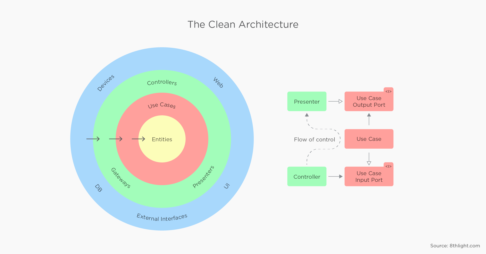
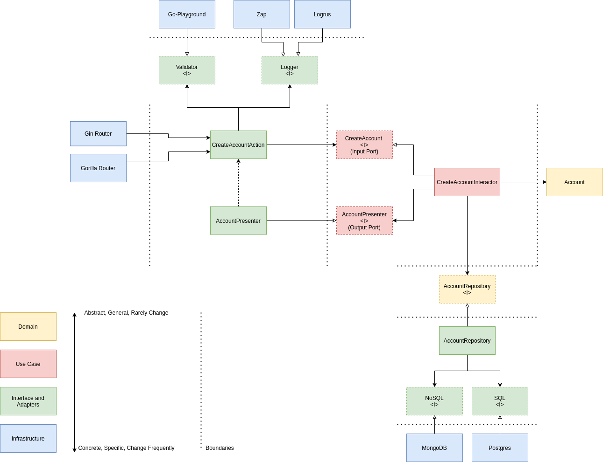

<h1 align="center">Welcome to Go Bank Transfer :bank:</h1>
<p>
  
  <a href="https://goreportcard.com/badge/github.com/GSabadini/go-bank-transfer" target="_blank">
    
  </a>
  <a href="#" target="_blank">
    
  </a>
  <a href="https://travis-ci.org/github/GSabadini/go-bank-transfer" target="_blank">
    
  </a>
  <a href="https://github.com/GSabadini/go-bank-transfer/actions" target="_blank">
    
  </a>
  <a href="https://codecov.io/gh/GSabadini/go-bank-transfer">
    
  </a>
</p>

- Go Bank Transfer is a simple API for some banking routines, such as creating accounts, listing accounts, listing balance for a specific account, transfers between accounts and listing transfers.

## Architecture
-  This is an attempt to implement a clean architecture, in case you don’t know it yet, here’s a reference https://blog.cleancoder.com/uncle-bob/2012/08/13/the-clean-architecture.html



## Example create account use case



## Requirements/dependencies
- Docker
- Docker-compose

## Getting Started

- Environment variables

```sh
make init
```

- Starting API in development mode

```sh
make up
```

- Run tests in container

```sh
make test
```

- Run tests local (it is necessary to have golang installed)

```sh
make test-local
```

- Run coverage report

```sh
make test-report
```
```sh
make test-report-func
```

- View logs

```sh
make logs
```

## API Request

| Endpoint        | HTTP Method           | Description       |
| --------------- | :---------------------: | :-----------------: |
| `/v1/accounts` | `POST`                | `Create accounts` |
| `/v1/accounts` | `GET`                 | `List accounts`   |
| `/v1/accounts/{{account_id}}/balance`   | `GET`                |    `Find balance account` |
| `/v1/transfers`| `POST`                | `Create transfer` |
| `/v1/transfers`| `GET`                 | `List transfers`  |
| `/v1/health`| `GET`                 | `Health check`  |

## Test endpoints API using curl

- #### Creating new account

`Request`
```bash
curl -i --request POST 'http://localhost:3001/v1/accounts' \
--header 'Content-Type: application/json' \
--data-raw '{
    "name": "Test",
    "cpf": "070.910.584-24",
    "balance": 100
}'
```

`Response`
```json
{
    "id":"5cf59c6c-0047-4b13-a118-65878313e329",
    "name":"Test",
    "cpf":"070.910.584-24",
    "balance":1,
    "created_at":"2020-11-02T14:50:46Z"
}
```
- #### Listing accounts

`Request`
```bash
curl -i --request GET 'http://localhost:3001/v1/accounts'
```

`Response`
```json
[
    {
        "id": "5cf59c6c-0047-4b13-a118-65878313e329",
        "name": "Test",
        "cpf": "070.910.584-24",
        "balance": 1,
        "created_at": "2020-11-02T14:50:46Z"
    }
]
```

- #### Fetching account balance

`Request`
```bash
curl -i --request GET 'http://localhost:3001/v1/accounts/{{account_id}}/balance'
```

`Response`
```json
{
    "balance": 1
}
```

- #### Creating new transfer

`Request`
```bash
curl -i --request POST 'http://localhost:3001/v1/transfers' \
--header 'Content-Type: application/json' \
--data-raw '{
	"account_origin_id": "{{account_id}}",
	"account_destination_id": "{{account_id}}",
	"amount": 100
}'
```

`Response`
```json
{
    "id": "b51cd6c7-a55c-491e-9140-91903fe66fa9",
    "account_origin_id": "{{account_id}}",
    "account_destination_id": "{{account_id}}",
    "amount": 1,
    "created_at": "2020-11-02T14:57:35Z"
}
```

- #### Listing transfers

`Request`
```bash
curl -i --request GET 'http://localhost:3001/v1/transfers'
```

`Response`
```json
[
    {
        "id": "b51cd6c7-a55c-491e-9140-91903fe66fa9",
        "account_origin_id": "{{account_id}}",
        "account_destination_id": "{{account_id}}",
        "amount": 1,
        "created_at": "2020-11-02T14:57:35Z"
    }
]
```

## Git workflow
- Gitflow

## Code status
- Development

## Author
- Gabriel Sabadini Facina - [GSabadini](https://github.com/GSabadini)

## License
Copyright © 2020 [GSabadini](https://github.com/GSabadini).
This project is [MIT](LICENSE) licensed.
